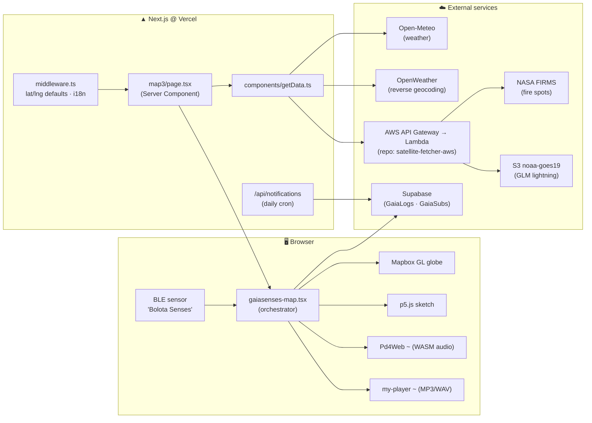
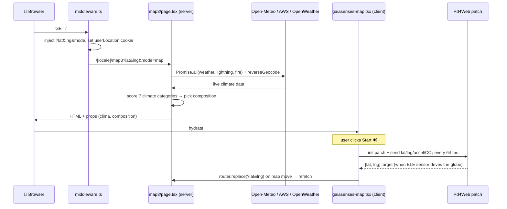

# 🌍 GaiaSenses Web

> **Real-time climate data → generative audiovisual art.**
> GaiaSenses transforms live weather, wildfire, and lightning data into location-aware generative compositions — p5.js for visuals, Pure Data (compiled to WebAssembly) for sound.

    

**Live deploy:** <https://gaiasenses-web.vercel.app> · **Organization:** <https://github.com/GaiaSenses>

---

## 📖 Table of Contents

1. [What is GaiaSenses?](#-what-is-gaiasenses)
2. [Architecture at a Glance](#%EF%B8%8F-architecture-at-a-glance)
3. [Live Data Sources](#-live-data-sources)
4. [Quick Start](#-quick-start)
5. [Environment Variables](#-environment-variables)
6. [Project Structure](#-project-structure)
7. [Request & Data Flow](#-request--data-flow)
8. [Composition Catalog](#-composition-catalog)
9. [Audio Subsystem (Pd4Web)](#-audio-subsystem-pd4web)
10. [BLE Sensor Pipeline](#%EF%B8%8F-ble-sensor-pipeline)
11. [npm Scripts](#-npm-scripts)
12. [Troubleshooting](#-troubleshooting)
13. [Reading Order for New Developers](#-reading-order-for-new-developers)
14. [Related Repositories](#-related-repositories)
15. [Known Issues & Tech Debt](#%EF%B8%8F-known-issues--tech-debt)

---

## 🎯 What is GaiaSenses?

GaiaSenses is a Next.js application centered on a map-first experience (route `map3`). Every visitor gets a composition tuned to the **real environmental conditions** of the location they are looking at.

| Mode | What it does | How to enter |
|---|---|---|
| 🗺️ **Map mode** | Interactive Mapbox globe + live weather panel + BLE sensor input + map audio patch | Default view |
| 🎬 **Player mode** | Fullscreen visual composition (p5.js) with matching audio | Select a composition, or let the climate auto-selection pick one (`?mode=player&composition=…`) |
| 🔁 **Auto mode** | Unattended tour across preset locations (installation/exhibition use) | Auto-mode toggle (`use-auto-mode.ts`, presets in `map-constants.ts`) |

There is no separate `/player` route — the player is a modal on top of the map, driven by URL query params.

---

## 🏗️ Architecture at a Glance



> ⚠️ **Do not decommission the [`satellite-fetcher-aws`](https://github.com/GaiaSenses/satellite-fetcher-aws) repository.** It is the infrastructure-as-code (AWS CDK) and the only source of the Lambda that serves fire and lightning data consumed by this app (see [Related Repositories](#-related-repositories)).

---

## 📡 Live Data Sources

| Data | Source | Where in code | Notes |
|---|---|---|---|
| 🌡️ Temperature, wind, humidity, clouds, rain | **Open-Meteo** (`api.open-meteo.com`) | `components/getOpenMeteo.ts` | No API key required |
| 🔥 Fire spots | **NASA FIRMS** (VIIRS, global coverage) via AWS Lambda | `components/getData.ts` → `…/prod/fire` | 100 km radius query |
| ⚡ Lightning | **GOES-19 GLM** (netCDF from S3 `noaa-goes19`) via AWS Lambda | `components/getData.ts` → `…/prod/lightning` | 100 km radius query; Next.js cache `revalidate: 7200` |
| 📍 Place names | **OpenWeather** reverse geocoding | `components/getData.ts` | The only remaining OpenWeather usage |
| 🗄️ Session telemetry & push subscriptions | **Supabase** (`GaiaLogs`, `GaiaSubs` tables) | `components/supabase.ts`, `lib/notifications.js` | Anon client (browser) + service-role client (server) |

---

## 🚀 Quick Start

### Prerequisites

| Requirement | Version | Why |
|---|---|---|
| Node.js | **≥ 18.17** (18/20/22 LTS all work) | Next.js 14 requirement |
| npm | ≥ 9 | `npm ci` uses the committed `package-lock.json` |
| Internet access | — | Live data (Open-Meteo, AWS, Mapbox tiles) is fetched at request time |
| Chromium-based browser | Chrome / Edge | **Web Bluetooth** (BLE sensor) only works in Chromium browsers |

No Docker, no local database, and no Pd patch compilation needed — the Pd4Web WASM bundles are pre-built and committed under `public/`.

### Steps

```bash
# 1. Install dependencies (~750 packages)
npm ci

# 2. Create .env.local in the repo root (see the Environment Variables section)

# 3. Start the dev server
npm run dev
# ▲ Next.js 14.x
# - Environments: .env.local   ← confirms your keys were loaded
# ✓ Ready

# 4. Open http://localhost:3000
```

Routes compile **on demand** — the first visit to `map3` takes noticeably longer than subsequent ones. The root URL redirects through the middleware:

```
/  →  /pt?lat=…&lng=…&mode=map  →  /pt/map3?lat=…&lng=…&mode=map&composition=…
```

`middleware.ts` injects `lat`/`lng` (request geolocation, with a São Paulo fallback in dev), sets the `userLocation` cookie, and the server picks a composition from the live climate data.

### 5. Click **Start** (required for audio) 🔊

Browsers only allow creating an `AudioContext` after a **user gesture**. The splash screen's Start button is that gesture — it initializes the Pure Data map patch (Pd4Web/WASM). Skipping it means visuals without sound.

### ✅ What you should see

- [ ] 3D Mapbox globe (requires a valid Mapbox token)
- [ ] Popup with the resolved city name and live data (temperature, humidity, wind, fire spots, lightning)
- [ ] `?composition=…` appended to the URL (climate-based auto-selection worked)
- [ ] A "Running Map sound …" status after clicking Start (audio patch active)

---

## 🔑 Environment Variables

Create `.env.local` in the repository root (it is gitignored via `.env*.local` — **never commit real keys**):

```env
# --- Required for the core experience ---
NEXT_PUBLIC_MAPBOX_API_ACCESS_TOKEN=pk.your_mapbox_token       # no token = black screen, no globe
OPEN_WEATHER_API_KEY=your_openweather_key                      # reverse geocoding only (city names)

# --- Satellite backend (fire + lightning) ---
SATELLITE_API_URL=https://<api-id>.execute-api.<region>.amazonaws.com/prod

# --- Recommended (session telemetry) ---
NEXT_PUBLIC_SUPABASE_URL=https://your-project.supabase.co
NEXT_PUBLIC_SUPABASE_ANON_KEY=your_anon_key

# --- Only needed to test web-push notifications ---
NEXT_PUBLIC_VAPID_PUBLIC_KEY=your_vapid_public_key
VAPID_PRIVATE_KEY=your_vapid_private_key
SUPABASE_SERVICE_ROLE_KEY=your_service_role_key                # ⚠️ most sensitive key — bypasses RLS
```

| Variable | Required? | Purpose |
|---|---|---|
| `NEXT_PUBLIC_MAPBOX_API_ACCESS_TOKEN` | ✅ Yes | Globe rendering (Mapbox GL) |
| `OPEN_WEATHER_API_KEY` | ✅ Yes | Reverse geocoding (place names). Weather itself comes from Open-Meteo, key-free |
| `SATELLITE_API_URL` | ✅ Yes | Base URL of the `satellite-fetcher-aws` API Gateway, without a trailing slash. Server-side only — never `NEXT_PUBLIC_*`. There is no fallback: unset, fire, lightning and rain report as unavailable |
| `SATELLITE_API_KEY` | ✅ Yes | Sent as `x-api-key`. The backend refuses requests without it. Server-side only, for the same reason as the URL |
| `NEXT_PUBLIC_SUPABASE_URL` / `NEXT_PUBLIC_SUPABASE_ANON_KEY` | 🟡 Recommended | Writes session telemetry to the `GaiaLogs` table |
| `NEXT_PUBLIC_VAPID_PUBLIC_KEY` / `VAPID_PRIVATE_KEY` | ⚪ Push only | Web-push (VAPID) notifications |
| `SUPABASE_SERVICE_ROLE_KEY` | ⚪ Push only | Server-side access to `GaiaSubs` (used by the daily cron) |
| `CRON_SECRET` | ⚪ Push only | Vercel sends it as `Authorization: Bearer …` on cron invocations. `/api/notifications` fails closed without it — **unset, no notification is ever sent** |
| `NEXT_PUBLIC_PD_WS_URL` | ⚪ Optional | WebSocket endpoint for the `/gaiaball` sensor bench (default `ws://localhost:9001`) |

Read the API key with the AWS CLI authenticated on the project account:

```bash
aws apigateway get-api-key --api-key <id> --include-value --query value --output text
```

> 🔎 **Fire, lightning and rain now need a key.** The backend used to answer anyone who asked, with no throttle and no spending ceiling. It sits behind an API key, a 10 rps throttle and a 50,000 request monthly quota — see `satellite-fetcher-aws`.
> 🧹 `MONGODB_URI` appears in older docs but is **not read by any code** — MongoDB is a leftover dependency. Do not bother setting it.

---

## 📁 Project Structure

```
app/
├─ [locale]/               ← i18n routes (pt = default, en)
│  ├─ map3/                ← ★ CORE: main page + ~20 modules (map, BLE, Pd4Web, panels)
│  ├─ gaiaball/            ← BLE sensor test bench (streams to a Pd WebSocket)
│  ├─ controller/ + host/  ← WebRTC remote-control pair (QR-code pairing)
│  └─ notifications/       ← push-subscription component
├─ api/
│  ├─ satellite/           ← consolidated climate JSON (no internal consumers)
│  └─ notifications/       ← triggered by Vercel Cron (daily, 12:00 UTC)
└─ old-main/               ← legacy gallery page (contains dead links — pending removal)

components/
├─ compositions/           ← 23 compositions (one folder each) + compositions-info.tsx (catalog)
├─ ui/                     ← shadcn/ui primitives (Radix)
├─ getData.ts              ← ★ ALL external data calls (weather, fire, lightning, geocoding)
├─ getOpenMeteo.ts · supabase.ts · supabaseClient.ts · dataSender.tsx

lib/                       ← notifications.js (web-push) · usersdb.js (Supabase service-role)
hooks/                     ← shared hooks (orientation, WebRTC, intervals)
scripts/                   ← sensor-websocket-server.mjs (standalone WS relay)
messages/                  ← pt.json · en.json (next-intl)
public/                    ← Pd4Web WASM bundles (one folder per patch) + audios/ + thumbnails + sw.js
types/                     ← pd4web.d.ts · window.d.ts
```

---

## 🔀 Request & Data Flow



**Climate → composition scoring** (`app/[locale]/map3/use-composition-queue.ts`): seven categories are scored and the winner picks a random composition among its candidates.

| Category | Trigger | Candidate compositions |
|---|---|---|
| 🔥 `infernus` | `fireSpots > 0` (+100, **early return** — fire dominates) | burningTrees, bonfire |
| ⚡ `spark` | `lightnings > 0` (+85) | lightningBolts, attractor, zigzag, stormEye |
| 💨 `aeolus` | `windSpeed × 2.5` | windLines, stormEye, riverLines |
| 💧 `flow` | `humidity × 0.5` | lluvia, digitalOrganism, riverLines, zigzag, curves |
| ☁️ `ethereal` | `clouds > 70` (+45) | cloudBubble |
| 🌡️ `thermal` | `temperature × 0.8` | colorFlower, generativeStrings, curves, riverLines, mudflatScatter |
| 🌌 `void` | baseline 25 (zeroed by storms/wind/humidity) | zigzag, attractor |

---

## 🎨 Composition Catalog

**Source of truth:** `components/compositions/compositions-info.tsx` — 23 registered compositions, each mapping to a folder under `components/compositions/`. Every entry declares `name`, `attributes` (climate inputs), `Component`, `endpoints`, `thumb`, and optionally `author`, `openProcessingLink`, `patchId`, `keepMapPatch`.

### ➕ Adding a new composition (checklist)

1. **Create the component** at `components/compositions/<new-composition>/<new-composition>.tsx` (plus a `*-sketch.tsx` for the p5.js sketch).
2. **Register it** in `compositions-info.tsx`:
   - import the component;
   - add the key to the `AvailableCompositionNames` union;
   - add the component type to the `AvailableCompositionComponents` union if needed;
   - add the entry to the `CompositionsInfo` object.
3. **Selectors update automatically** — `CompositionDropdown` iterates `Object.entries(CompositionsInfo)`.
4. *(Optional)* add the key to the category arrays in `use-composition-queue.ts` for climate auto-selection.
5. *(Optional)* add a preset location in `map3/map-constants.ts` for auto-mode targeting.
6. *(Optional)* attach a dedicated audio patch — see [Pattern A](#pattern-a--dedicated-player-patch) below.

> 💡 Most compositions play pre-rendered **MP3/WAV** files (`public/audios/`, singleton player with crossfade in `my-player.tsx`). A few drive **Pd4Web patches**, and `airports` uses **Tone.js** (an implementation of Brian Eno's *Discrete Music*, 1975).

---

## 🔊 Audio Subsystem (Pd4Web)

Pure Data patches are compiled to WebAssembly with [pd4web](https://charlesneimog.github.io/pd4web/) and loaded from `public/<bundleFolder>/`:

```
public/<bundleFolder>/
├─ pd4web.js      ← Emscripten loader (sets window.Pd4WebModule)
├─ pd4web.wasm    ← the patch + libpd compiled
├─ pd4web.data    ← audio assets/abstractions
└─ index.pd       ← patch entry point
```

**Compile flags:** `--export-es6-module --nogui` (optionally `-m 64` for 64 MB of memory).
**Runtime requirement:** WASM threads need `SharedArrayBuffer`, which requires the **COOP/COEP headers** already configured in `next.config.js` — do not remove them.

### Lifecycle (`app/[locale]/map3/pd4web-context.tsx`)

`startPatch(patchId)` performs, in order:

1. Looks up the patch metadata in `pd4web-patches.ts`;
2. Dynamically imports `/<bundleFolder>/pd4web.js` (the Emscripten loader);
3. Fetches `/<bundleFolder>/pd4web.wasm`;
4. Initializes the patch via the `Pd4Web` class (`openPatch("index.pd")` + `init()`, which starts Web Audio);
5. Stores `activePatch` and the `pd4web` instance in the React context and inserts a fade GainNode between the worklet and the destination.

**One patch is active at a time** — `startPatch` rejects if another patch is running or a start/stop is in flight.

`stopPatch()` → applies a 0.5 s fade-out, closes the AudioContext and audio resources, clears the active-patch state.

### Patch registry & binding metadata (`app/[locale]/map3/pd4web-patches.ts`)

Every patch entry declares **when** it activates and **how** it binds to the app:

| Field | Values | Purpose |
|---|---|---|
| `activation.moments` | `["map"]`, `["player"]`, or both | In which mode(s) the patch may run |
| `activation.compositions` | optional list of composition keys | Restricts a player patch to specific compositions |
| `binding.type` | `"map-center"` \| `"none"` | `map-center` wires the patch to globe position + sensor data |
| `binding.…Receiver` | Pd receive-symbol names | `latitudeReceiver`, `longitudeReceiver`, `sensorListReceiver`, `outputListReceiver`, `accXReceiver`/`accYReceiver`/`accZReceiver`, `co2Receiver` |
| `binding.pollMs` / `epsilon` / `accEpsilon` | numbers | Send interval (ms) and change thresholds — values are only re-sent when the delta exceeds the epsilon |

Complete example of a map-mode patch registration:

```ts
{
  id: "myMapPatch",
  label: "My Map Patch",
  bundleFolder: "my-map-patch", // must match the folder name under public/
  activation: {
    moments: ["map"],
  },
  binding: {
    type: "map-center",
    latitudeReceiver: "latitude",
    longitudeReceiver: "longitude",
    sensorListReceiver: "input",
    outputListReceiver: "output",
    accXReceiver: "aceX",
    accYReceiver: "aceY",
    accZReceiver: "aceZ",
    co2Receiver: "input_co2",
    pollMs: 64,
    epsilon: 0.5,
    accEpsilon: 0.05,
  },
}
```

### App ⇄ Pd message contract

```text
App → Pd   receiver "input"  (every 64 ms, list):
           [gyroX gyroY gyroZ accX accY accZ co2]

Pd → App   receiver "output" (list):
           [latitude longitude]   → moves the globe target
```

The map patch is **part of the control loop**, not just an audio sink: with the default mapping method (`pd`), the patch computes the globe's target position from accelerometer data. Safety rule (implemented in `gaiasenses-map.tsx`): Pd output only moves the globe while a sensor is connected (input mode ≠ mouse). Without a sensor, the app sends `latitude`/`longitude`/`aceX/Y/Z`/`input_co2` as individual floats instead.

Available Pd4Web methods: `sendBang`, `sendFloat`, `sendList`, `sendSymbol` and listeners `onBangReceived`, `onFloatReceived`, `onListReceived`, `onSymbolReceived`. Reference sketches: **lightningBolts** (sketch → patch), **lluvia** (start bang + periodic events from patch → drawing).

> ⚠️ **Always keep receiver names synchronized.** Receiver names are plain strings shared between TypeScript (`pd4web-patches.ts`) and the `[receive]` objects inside the Pure Data patch — nothing type-checks them across that boundary. A mismatch fails **silently**: the patch runs, but no data arrives. Whenever a patch is recompiled or edited, re-check its receive symbols against the registry entry (the patch log panel is the fastest way to verify).

### Binding patterns

#### Pattern A — dedicated player patch
Patch runs only for one composition in player mode.
1. Add the patch to `pd4web-patches.ts` with `activation.moments: ["player"]` and `activation.compositions: ["<compositionKey>"]` (recommended for clarity).
2. Set `patchId` on the composition entry in `compositions-info.tsx`; leave `keepMapPatch` unset (or `false`).

*Runtime behavior:* when the composition is selected and player mode opens, `composition-dropdown.tsx` **stops the current map patch** (if active and `keepMapPatch` is false) and **starts the patch referenced by `patchId`**. `toggle-play-button.tsx` handles restoring/stopping patches when returning from the player to the map.

#### Pattern B — keep the map patch
Composition keeps the map's audio running: set `keepMapPatch: true` on the composition entry.

*Runtime behavior:* `gaiasenses-map.tsx` computes `hasSharedPd4WebPatch` from `keepMapPatch`, which allows the map patch to remain active while the player composition is displayed.

### ➕ Adding a map-mode patch (checklist)

1. Compile with `pd4web --export-es6-module --nogui`.
2. Copy the bundle to `public/<your-bundle-folder>/` (must contain the 4 files above).
3. Register it in `app/[locale]/map3/pd4web-patches.ts` with a `map-center` binding and the correct receiver names.
4. Start it via the map audio button and validate I/O in the **patch log panel** (`pd4web-patch-log.tsx`).

---

## 🎛️ BLE Sensor Pipeline

| Layer | File | Role |
|---|---|---|
| Connection | `app/[locale]/map3/ble-control.tsx` | Web Bluetooth GATT: service `19b10000-e8f2-537e-4f6c-d104768a1214`, sensor char `…0001` (notify), CO₂ char `…0003` (notify). JSON payloads: `{quat, euler, acc}` and `{co2:{ppm}}`. Auto-reconnect (5 × 1.5 s) |
| Orchestration | `app/[locale]/map3/use-ble-sensor.ts` | Routes packets to smoothing, handles calibration lifecycle and CO₂ side effects |
| Smoothing & motion | `app/[locale]/map3/use-sensor-smoothing.ts` | Baseline calibration (quaternion, Euler fallback), median + EMA filtering, 30 Hz `requestAnimationFrame` loop, state machine `calibrating → idle → moving → settling → stopped` |

**Mapping methods:** `pd` (default — the Pure Data patch computes the target), `quaternion`, `euler`, `basic`.

**CO₂ as a trigger:** hysteresis around **1200 ppm** — above the threshold a composition opens automatically; back below, it closes and returns to the map. A CO₂ ramp simulator (`useCo2Simulation`) lets you test without hardware, via the motion tuning panel.

**Auxiliary tooling:** live motion-tuning panel (`motion-tuning-panel.tsx`), patch I/O log panel, standalone WebSocket sensor relay (`npm run sensor:ws`, port 3001), and the `/gaiaball` route as a sensor test bench.

---

## 📜 npm Scripts

| Script | Purpose | Notes |
|---|---|---|
| `npm run dev` | Dev server on `localhost:3000` | Day-to-day development |
| `npm run dev-remote` | Dev server bound to a LAN IP | ⚠️ The IP is hardcoded — edit it for your machine (useful to test BLE from a phone) |
| `npm run build` / `npm start` | Production build / serve | Run `build` before opening a PR |
| `npm run lint` | ESLint (Next config) | |
| `npm run sensor:ws` | Standalone sensor WebSocket relay | `SENSOR_WS_HOST` / `SENSOR_WS_PORT` (defaults `0.0.0.0:3001`) |
| `npm run normalize:pd4web` | Normalize a Pd4Web bundle in `public/` | Only when adding/updating audio patches |

---

## 🩺 Troubleshooting

| Symptom | Cause | Fix |
|---|---|---|
| Black screen, no globe | Missing/invalid Mapbox token | Set `NEXT_PUBLIC_MAPBOX_API_ACCESS_TOKEN` and **restart** the dev server (env is read at boot) |
| First page load takes ~30 s+ | On-demand route compilation | Normal on first visit; subsequent loads are fast |
| Visuals play but **no audio** | The Start button was skipped — browsers require a user gesture to create an `AudioContext` | Click **Start** / the sound button |
| No audio on Linux/WSL2 browsers | The browser has no audio backend (e.g., WSL distro missing `libpulse0`; `enumerateDevices()` returns 0 outputs) | Use the host OS browser at `localhost:3000`, **or** install the PulseAudio client library (`sudo apt install libpulse0`) and fully restart the browser |
| Console: `…run Pd4Web.init() from a click event!` | Audio init attempted without a real user gesture | Expected under automation; click manually |
| Patch starts but is silent | Wrong `bundleFolder` or missing `pd4web.wasm` | Verify the bundle folder contents in `public/` |
| Wrong patch stays active after switching compositions | Patch/composition wiring | Inspect `compositions-info.tsx` (`patchId`, `keepMapPatch`), `composition-dropdown.tsx`, `toggle-play-button.tsx` |
| BLE sensor won't connect | Non-Chromium browser, or Bluetooth belongs to the host OS | Use Chrome/Edge; on WSL2 run the browser on Windows. Without hardware, use the CO₂ simulator |
| Lightning always shows `count: 1` | Known pitfall: `getData.ts` returns a mock on lightning API failure | Check connectivity to the AWS API Gateway (tracked as tech debt) |
| Stale/weird build errors after switching branches | Next.js cache | `rm -rf .next` and restart |
| Port 3000 busy | Another process | `npx next dev -p 3001` |

---

## 📚 Reading Order for New Developers

If you have 10 minutes to understand a bug, open these in order:

1. `app/[locale]/map3/gaiasenses-map.tsx` — the orchestrator; everything passes through here
2. `components/getData.ts` — the entire external data layer in one file (including the AWS coupling)
3. `app/[locale]/map3/use-ble-sensor.ts` → `use-sensor-smoothing.ts` — sensor pipeline
4. `app/[locale]/map3/pd4web-context.tsx` → `pd4web-patches.ts` — audio lifecycle and patch registry
5. `components/compositions/compositions-info.tsx` — the catalog; then `use-composition-queue.ts` for auto-selection

This path covers almost all behavior coupling in `map3`.

---

## 🤝 Related Repositories

### [`satellite-fetcher-aws`](https://github.com/GaiaSenses/satellite-fetcher-aws) — ⚠️ production dependency

AWS CDK (TypeScript) project that provisions the satellite-data backend consumed by this app:

- **Lambda (Docker, Python 3.13, ARM64, 512 MB):** `GET /fire` (NASA FIRMS), `GET /lightning` (GOES-19 GLM from S3), `GET /rain` (GOES-19 RRQPE).
- **API Gateway** (`/prod` stage) — every route requires an API key, under a usage plan with a 10 rps throttle and a 50,000 request monthly quota. The base URL and the key come from `SATELLITE_API_URL` and `SATELLITE_API_KEY`; nothing about the endpoint is in source.
- Local testing: `docker build` + `docker run` (see that repo's README); requires a `FIRMS_MAP_KEY` (NASA FIRMS API key).
- Deploy: `npx cdk diff` → `npx cdk deploy`. The CDK uses the AWS SDK, which does **not** read the session `aws login` writes — bridge it with `eval "$(aws configure export-credentials --format env)"` first.

**History:** the fetcher originally ran on Railway (2023–2025) and was migrated to AWS Lambda in March 2025. Weather data was later moved off the fetcher to Open-Meteo. In August 2026 the whole backend was redeployed into the project's own AWS account — until then it ran in a personal account belonging to someone no longer on the project, which nobody on the team could log into, rotate a credential in, or answer a bill for.

---

## ⚠️ Known Issues & Tech Debt

- 🔌 **Nobody knows who owns the OpenWeather account**, and the Render service behind `/pt/controller` answers 404 — it is gone. Both in [`docs/contas-e-servicos.md`](docs/contas-e-servicos.md), which asks of every external service the question that matters: if this account is closed tomorrow, can the team act?
- 🗺️ **The Mapbox token belongs to someone who left the project.** Every Mapbox token is a JWT with the owner in its payload, and the one in use decodes to a personal account. Nobody on the team can restrict it by URL, rotate it, or see its quota, and the globe goes down with that account. Opening a new Mapbox account requires a credit card, so this is a decision for the research team — see `docs/mapa-alternativas.md`, which has a working MapLibre spike and side-by-side screenshots.
- 🔔 **`CRON_SECRET` is not set in production**, so `/api/notifications` answers 503 to everyone including Vercel's own cron. No push notification has been sent since it started failing closed; four of the five subscribers have been stranded since July 2026.
- 📦 ~~Several declared dependencies have zero imports~~ — removed (HIG-01): `mongodb`, `joy-con-webhid`, `@mediapipe/tasks-vision`, `@xenova/transformers`, `react-webcam`, `react-h5-audio-player`, `react-three-map`, `react-geolocated`. Note that `tone` was **not** dead: `components/compositions/airports/discrete.tsx` loads it with a dynamic `await import("tone")`, which a plain import grep misses.
- 🗂️ `public/` carries ~191 MB, and `public/audios/` is 176 MB of it — 92% of the repository, with no owner and no plan. git-lfs does not fit the free quota and a CDN runs into the `require-corp` COEP header that Pd4Web needs.
- 🐘 Postgres is on `15.8.1.111`, which Supabase flags as having outstanding security patches. The free-plan upgrade path is Pause & Restore; it was run and the version did not move.
- 🎛️ `/pt/controller` answers 200 and the server it talks to is gone — remove it or bring it back.
- 🧪 No tagged releases. Contract tests for the data layer exist under `tests/`; the rest is uncovered.
- 🛰️ UI "about" texts mention older satellites (GOES-16/17); the backend now reads **GOES-19**.

---

*This README consolidates the original teammate handoff guide with a verified local-setup guide (validated on a clean environment, Node 22, July 2026). For a deeper architecture dossier, ask the team for the internal technical report.*
