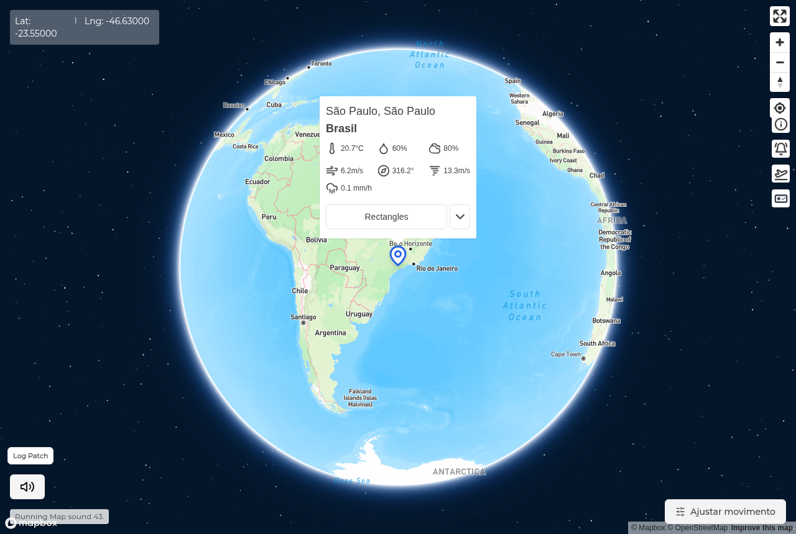
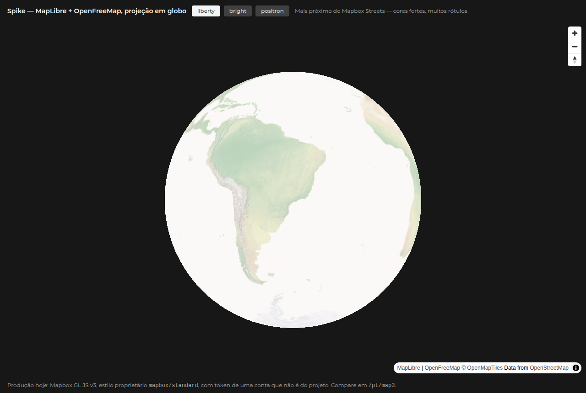

# O mapa: situação da conta e alternativas

## O problema

O globo do GaiaSenses é desenhado pelo Mapbox GL JS v3, com o estilo
`mapbox://styles/mapbox/standard` e projeção `globe`
(`app/[locale]/map3/gaiasenses-map.tsx`).

O token em uso **não pertence ao projeto**. Todo token do Mapbox é um JWT com o
dono no payload, e o atual decodifica para:

```json
{ "u": "fmammoli", "a": "clscc1n6o0mkx2mqucawphhwl" }
```

É a conta pessoal do **Felipe Mammoli, que não faz mais parte do projeto**
(registrado em agosto de 2026). As consequências práticas:

- Ninguém do time consegue aplicar as restrições de URL que o token precisa —
  hoje ele responde a qualquer domínio e até a requisição sem `Referer`.
- Ninguém consegue rotacioná-lo se vazar, nem acompanhar a cota.
- Se a conta for encerrada, mudar de plano ou estourar o limite gratuito, **o
  mapa do GaiaSenses cai** e o time não tem como agir.
- A fatura, se houver, é de uma pessoa física que saiu do projeto.

Criar uma conta nova no Mapbox **exige cartão de crédito**. Daí a decisão que
cabe ao time de pesquisa, e não ao código.

## Caminho A — conta institucional no Mapbox

Cadastrar o cartão da pesquisa e criar a conta do projeto (o e-mail
`gaiasenses.cti@gmail.com` já é usado como contato do VAPID).

**A favor:** nada muda no código. O visual, a projeção em globo e o estilo
`standard` continuam idênticos. É o caminho de menor risco técnico e o mais
rápido.

**Contra:** exige cartão institucional e cria uma dependência comercial contínua.
O plano gratuito do Mapbox cobre até 50 mil carregamentos de mapa por mês; acima
disso é cobrado, e a cobrança cai no cartão cadastrado.

## Caminho B — MapLibre GL JS

MapLibre GL JS é o fork livre (BSD-3) do Mapbox GL JS, mantido pela comunidade
depois que o Mapbox fechou a licença na v2. A API é a mesma de onde o fork
saiu, e o `react-map-gl` que já está no projeto suporta os dois — há um ponto de
entrada `react-map-gl/maplibre`. Não usa token.

### O spike foi feito — o globo funciona

A incerteza técnica está respondida. A página `/[locale]/spike-mapa` (branch
`spike/maplibre-globo`) roda MapLibre GL JS v6 com `react-map-gl/maplibre`, que
já estava instalado, e `projection={{ type: "globe" }}`. **Sem token, sem
cadastro, sem cartão.** O globo gira e responde normalmente.

O que o spike também mostrou é que o problema mudou de lugar: não é mais *se*
dá, é *como fica*.

| hoje — Mapbox `standard` | MapLibre + OpenFreeMap `liberty` |
|---|---|
|  |  |

O Mapbox entrega oceano azul, halo de atmosfera, estrelas e rótulos de país já
no zoom 2 — é isso que faz a tela de abertura parecer um planeta. Os estilos do
OpenFreeMap são pensados para mapa plano de rua: o oceano sai quase branco e o
globo lê como um disco claro.

Tentei fechar a diferença dentro do spike, com `setSky` e sobrescrita das
camadas `water` e `background`. Nenhuma das duas pegou — os nomes de camada do
liberty não batem, e o prop `sky` não é repassado pelo `react-map-gl` v8. Parei
aí de propósito: dá para resolver com um estilo próprio, mas isso é trabalho a
ser dimensionado, não remendo de spike.

Também vale registrar uma incompatibilidade encontrada: o `maplibre-gl` v5 não
serve, porque o `react-map-gl` 8.1.1 importa `dist/maplibre-gl.mjs`, arquivo que
só existe a partir do v6.

O MapLibre é o motor; o desenho vem de uma fonte de tiles separada:

| Fonte | Cadastro | Visual | Observação |
|---|---|---|---|
| **OpenFreeMap** | **nenhum** — sem conta, sem chave, sem cartão | estilos *liberty*, *bright* e *positron*; muito próximo do Mapbox Streets | mantido por doação, sem SLA |
| **Protomaps** | nenhum, se auto-hospedado | temas *light*, *dark*, *white*, *black*; bastante limpo | um arquivo `.pmtiles` servido de qualquer host estático — controle total |
| MapTiler / Stadia / CARTO | conta obrigatória | bons | têm plano gratuito, mas **confirmar se pedem cartão** antes de considerar |

**A favor:** elimina a dependência de conta de terceiro. OpenFreeMap e Protomaps
não pedem cadastro nem cartão, o que resolve o impasse sem passar pela
burocracia da pesquisa. Com Protomaps auto-hospedado, o projeto deixa de
depender de qualquer serviço externo para o mapa.

**Contra:** o estilo `standard` do Mapbox é proprietário e tem prédios em 3D e
iluminação por hora do dia — nenhuma alternativa reproduz isso igual. A
troca é perceptível. Além disso, é trabalho de migração real, e o OpenFreeMap
não oferece garantia de disponibilidade.

## Caminho C — outra biblioteca

Leaflet e OpenLayers são maduros e livres, mas são 2D. Para este projeto isso
não serve: o globo não é enfeite, é a interação central — o usuário gira o
planeta e o som responde à latitude e longitude. Descartado.

## Recomendação

A conversa com o time de pesquisa agora pode ser sobre o que se vê, e não sobre
preferência. As duas imagens acima são o material.

A escolha ficou assim:

- **Se o visual do planeta é parte da identidade do GaiaSenses** — e a tela de
  abertura sugere que é —, o Caminho A entrega isso sem trabalho nenhum, ao
  custo de um cartão institucional. O Caminho B chega perto, mas exige construir
  um estilo próprio, o que é um projeto com começo, meio e fim, não um ajuste.
- **Se o mapa é sobretudo funcional**, o Caminho B resolve hoje, de graça, e
  ainda tira o projeto de uma dependência que ninguém controla.

O que **não** é opção é seguir como está: um token de terceiro, irrestrito, que
o projeto não pode rotacionar nem substituir com urgência.
